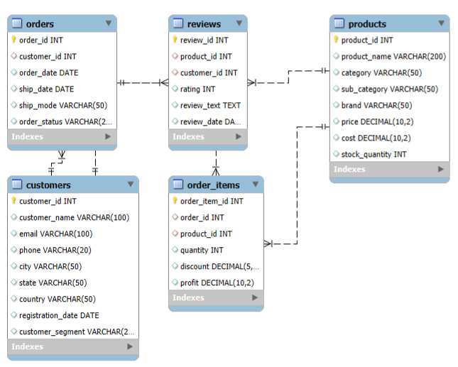
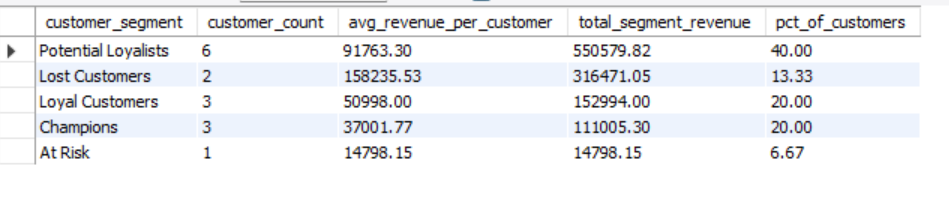
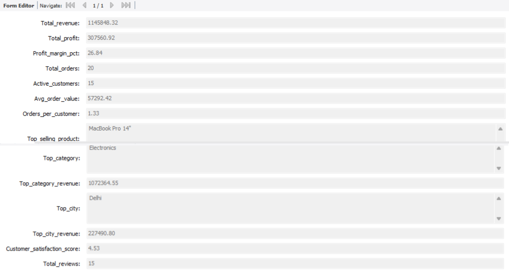

# 🛒 E-Commerce Customer Analytics | SQL + Power BI Project

> 📊 End-to-End Data Analytics Project — From MySQL to Power BI Insights  

---

## 📘 Project Summary

This project demonstrates a **complete analytics pipeline** for an **E-Commerce business**, integrating **SQL-based data modeling and analysis** with **Power BI visualization** to uncover valuable business insights.

Built to answer key business questions like:
- Which product categories generate the most revenue?
- Who are our most loyal or at-risk customers?
- How efficient are our shipping operations?
- What’s the overall customer retention and lifetime value?

---

## 🚀 Project Highlights

✅ Designed and analyzed a **MySQL database** for e-commerce transactions  
✅ Performed advanced **RFM segmentation, Cohort, and CLV analyses** using SQL  
✅ Built an interactive **Power BI dashboard** for business reporting  
✅ Delivered **data-driven insights** for decision-makers

---

## 🧠 Key Insights

| Category | Insight |
|-----------|----------|
| 💰 **Revenue** | Achieved total sales of ₹11.45 Lakh with a 26.8% profit margin |
| 👥 **Customers** | 40% of users identified as *Potential Loyalists* |
| 🕒 **Retention** | Repeat purchases observed in 30% of monthly cohorts |
| 🚚 **Shipping** | Standard shipping method caused highest delays |
| ⭐ **Satisfaction** | Avg. customer rating: 4.53 / 5 |

---

## 🧩 Tech Stack

| Technology | Purpose |
|-------------|----------|
| 🗄️ **MySQL** | Data storage, cleaning, and analytics (RFM, Cohort, CLV) |
| 📊 **Power BI** | Visualization and storytelling layer |
| 🧮 **Excel** | Data validation and minor preprocessing |
| 🧰 **Git & GitHub** | Version control and documentation |

---

## 🏗️ Database Schema

The SQL database includes relational tables connecting customers, orders, products, and reviews.

**Core Tables:**
- `customers` — Customer demographics & IDs  
- `orders` — Order-level details  
- `order_items` — Transaction details for each order  
- `products` — Product catalog and pricing  
- `reviews` — Customer satisfaction ratings  

---

## 🔍 Analytical SQL Modules

### 1️⃣ **Sales Performance Analysis**
`queries/01_sales_performance.sql`  
- Revenue, profit, and top-performing categories/products  
- Yearly/monthly trends and product-level insights  

### 2️⃣ **RFM Segmentation**
`queries/02_rfm_segmentation.sql`  
Segments customers into key behavioral groups:  
| Segment | Description |
|----------|--------------|
| 🏆 **Champions** | Recent, frequent, high-value buyers |
| 💚 **Loyal Customers** | Repeat purchasers with consistent orders |
| ⚠️ **At Risk** | Previously active but inactive lately |
| 💤 **Lost Customers** | Haven’t ordered in a long time |

### 3️⃣ **Cohort Analysis**
`queries/03_cohort_analysis.sql`  
Tracks monthly customer retention trends to understand loyalty over time.

### 4️⃣ **Customer Lifetime Value (CLV)**
`queries/04_customer_lifetime_value.sql`  
Computes each customer’s lifetime revenue contribution using total spend and recency.

### 5️⃣ **Operational & Sentiment Analysis**
Includes:
- Geographic revenue performance (`05_geographic_analysis.sql`)
- Shipping performance & delays (`06_shipping_efficiency.sql`)
- Discount impact on profit (`07_discount_analysis.sql`)
- Customer review sentiment scoring (`08_review_sentiment.sql`)
- Executive KPI dashboard queries (`09_executive_dashboard.sql`)

---

## 📊 Power BI Dashboard

After extracting key SQL results, data was imported into **Power BI** to build a real-time executive dashboard that highlights:

- 📈 Total Sales, Profit, and Margin  
- 👥 Customer Segmentation (RFM)  
- 🕓 Retention Cohort Trends  
- 🌍 Regional Performance Map  
- ⭐ Satisfaction & Review Summary  

### 🖼️ Dashboard Preview

**Power BI Features Used:**
- DAX for calculated measures (Profit %, CLV, AOV)  
- Dynamic slicers for category/city/period filtering  
- Conditional formatting for performance thresholds  
- Interactive visuals for RFM & cohort analysis  

---

## 🧮 Business Results

| KPI | Result | Description |
|-----|---------|-------------|
| 💰 **Revenue** | ₹11,45,848 | Total business turnover |
| 🏆 **Profit Margin** | 26.84% | Net profit ratio |
| 👥 **Customer Retention** | 30% | Returning customer ratio |
| 💚 **Loyal Segment** | 20% | Core repeat customers |
| 📦 **Avg Order Value** | ₹3,820 | Purchase behavior metric |

---

## 📂 Project Structure

